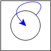

# 递归与循环数据（Cyclic Data）

递归的数据一般是这两种情况中的一种；引用与自身相同类型的事物，或者就是直接引用自身。

第一种情况即我们传统称为**递归数据结构**的东西。例如，树是一个递归的数据结构，一个顶点可以有多个子节点，每个子节点自身也是一颗树。一段程序可以不记录哪些节点已经被访问过就能够完整的遍历一颗树并结束。树是有穷的数据结构。

与之对应的，图是循环数据结构（cyclic datum）：一个节点引用另一个节点，并可能最终通过引用链引用到自身。（当然，节点还可以直接引用自身。）在不记录已访问节点的情况下去遍历一个图，计算过程将不会自动停止。图算法需要我们开辟一块内存存放已访问过的节点来避免重复访问。

给我们的语言添加递归的数据结构，如列表或树，比较简单直接。主要需要实现两点：

1. 创建复合结构（compound structure）的能力（例如节点中引用子树）；
2. 结束递归的能力（如树结构的叶子节点）

> 练习：给语言添加列表和二叉树

循环数据结构的实现比较微妙一点。考虑最简单的情况，自引用。



尝试在 Racket 中定义这种结构，下面是一个尝试：

```scheme
(let ([b b])
  b)
```

可以看出，这样做显然有问题，let 中右侧那个 `b` 未绑定。把语法糖解开可以看的更清楚一点：

```scheme
((lambda (b)
   b)
  b)
```

清晰起见，将函数参数重命名：

```scheme
((lambda (x)
  x)
 b)
```

明显 `b` 处于未绑定状态。

不使用之前未介绍的 Racket 构造的情况下，不能直接创建出循环的数据结构。我们需要给数据创建一个“地址”，然后在数据自身中引用该地址。注意这里是用了“然后”，它暗示时间的引入，即我们需要使用 mutation 操作。这样的话我们可以尝试使用上一章 box 来实现。

> 上面说的未介绍的 Racket 构造指的是 **shared**。我们不深究 Racket 的 shared 构造，但是我们这里学习的东西正是 **shared** 幕后实现的基本原理。

首先，创建一个 box 然后绑定到一个标识符，设为 `b`；然后改变 box 中的值，我们希望其中存什么呢？当然是对自身的引用。怎么获得该引用呢？通过名字 `b`。通过这种方式，我们创建了一个环状数据：

```scheme
(let ([b (box 'dummy)])
  (begin
    (set-box! b b)
    b))
```

注意，上面的程序在 *Typed PLAI* 中不能运行，后面会谈到如何给该程序添加类型。现在，要运行上面的程序，请使用 *PLAI*  语言（`#lang plai`）。

运行上面的程序将得到 `#0=’#&#0#`。分析一下该表示就会发现它正是我们要的东西。回想一下，前面提到过 `#&` 是 Racket 中 box 的打印方式。`#0=`（其中数字换成其他的也是一样）是 Racket 中对于循环数据的命名方式。因此，上面结果字面意思就是“`#0` 被绑定到了一个 box，其内容为 `#0#`，该内容指的是绑定到 `#0` 的东西，这里，这个东西就是它自己”。

> 练习：在前面实现的解释器中运行与上面这段等价的代码，确保其产生一个循环的数据值（cyclic value）。怎么检测这一点呢？

上面这种思想可以扩展到其它数据结构中。通过这种方式我们能够创建环状的列表、图，等。核心思想就是，创建一个名字绑定到一个作为占位符的空数据；然后修改该占位符中的内容为其自身；这样我们便可以通过使用该绑定的名字引用“自身”了。当然，不止自引用数据，多个数据的互引用的环形结构也可以通过这种方式实现。


## 递归函数 ##

澄清一下名词，递归函数不是引用与自身相同类型的函数而是引用自己的函数。添加条件分支的支持将是非常有用的（前面第五章练习中有让添加条件控制结构的，可以去实现一下），这样我们就可以写出能够自动终结的程序。

首先，实现一个阶乘函数：

```scheme
(let ([fact (lambda (n)
              (if0 n
                   1
                   (* n (fact (- n 1)))))])
  (fact 10))
```

这根本行不通！它将报和前面循环数据结构例子相同的错误，即存在未绑定的标识符。

不过细想一下，出现这种错误不应让我们感到奇怪。毕竟到目前为止，我们实现的绑定从来没有考虑到对于函数定义环形引用的支持（事实上在早期的程序语言中，递归并不当作理所当然的，它们被当作特殊的特性）。这里，我们当然想要递归，我们希望函数能够引用它自己，我们必须手工实现这点。

那么我们要做的事情也很清晰了，使用和前面相同的方案。三步走，首先创建一个占位数据，然后创建我们要引用的数据（这里即一个函数），然后修改该占位数据引用函数：

```scheme
(let ([fact (box 'dummy)])
  (let ([fact-fun
         (lambda (n)
           (if (zero? n)
               1
               (* n ((unbox fact) (- n 1)))))])
    (begin
      (set-box! fact fact-fun)
      ((unbox fact) 10))))
```

事实上，我们并不需要 `fact-fun`，这样写只是为了清晰起见。注意到 `fact-fun` 不是递归的，我们可以直接使用其值而不是先将该值绑定到标识符上，即：

```scheme
(let ([fact (box 'dummy)])
  (begin
    (set-box! fact
              (lambda (n)
                (if (zero? n)
                    1
                    (* n ((unbox fact) (- n 1))))))
    ((unbox fact) 10)))
```

这里有点小瑕疵，即我们使用 `fact` 的时候总得 `unbox` 它，对于拥有变量的语言，它的实现看起来更完美：

```scheme
(let ([fact 'dummy])
    (begin
      (set! fact
            (lambda (n)
              (if (zero? n)
                  1
                  (* n (fact (- n 1))))))
      (fact 10)))
```

## premature observation ##

到这里我们发现前面的东西有一些共性，它们的实现遵循着一个相同的脉络：创建、更新、使用。我们可以将这个过程裹在语法糖中。考虑实现下面的语法：

```scheme
(rec name value body)
```

举个例子：

```scheme
(rec fact
     (lambda (n) (if (= n 0) 1 (* n (fact (- n 1)))))
     (fact 10))
```

它将计算得到 10 的阶乘。该语法糖解开会得到：

```scheme
(let ([name (box 'dummy)])
  (begin
    (set-box! name value)
     body))
```

这里，我们作出了这样的假设，即 `value` 盒 `body` 部分对于 `name` 的引用都写成了 `(unbox name)`，或者在实现了变量的语言中，我们可以将语法糖解开成：

```scheme
(let ([name 'dummy])
  (begin
    (set! name value)
    body))
```

这里有一个很有趣的问题，如果我们在使用上面的东西的时候搞砸了怎么办？具体来说，如果在更新真实值到 `name` 指向的数据之前引用了 `name` 会怎样？这时候我们将看到该结构初始化时系统内部给其的初始的无意义的值（如对 Java 来说，声明了变量未赋值时它引用的东西）。一个合法的值意味着它能够被用于某些计算过程，如果一段程序引用了上面说的这种未定值，你可以说该段程序事实上进行的是毫无意义的计算。

对于该问题一般有三种解决方式：

1. 确保该值看上去足够模糊，让人在写代码的时候能够很容易的意识到它在程序上下文中没有意义。这意味着选择像 `0` 这种值不是一个好的决定，你应该创建一个新的类型的值专门用在这种地方，将该种值传入其它计算过程将导致错误的抛出；
2. 显式的检查一个值处于这种未定状态，这种方案虽然可行，但也意味着程序的性能会遭挫。然而，由于实现简单，很多教学用语言会使用这种方式；
3. 保证这种递归构造只在进行函数绑定时被使用，通过在语法层面上限制绑定的值为函数来实现这点。但是这种方式过于极端，因为它使得我们不能写出像上面说的图这种结构。

## 不使用显式状态（without explicit state） ##

聪明的你可能意识到了我们可以另一种不需要显式 mutation 操作的方式定义递归函数（对于递归数据也是一样）。

> 自己尝试一下：
>
> 你可能已经意识到只使用 `let` 来定义递归函数哪里有点不对劲了。努力的思考一下该怎么弄。提示： Subsitute more. And then more. And more!

仅使用函数来获得递归是一个非常棒的想法。Daniel P. Friedman 和 Matthias Felleisen 在他们的书《The Little Schemer》中非常好的描述了这点。你可以读一下其[样章](http://www.ccs.neu.edu/home/matthias/BTLS/sample.pdf)。（事实上笔者之前一篇文章中简单写过它，无耻的引用一下：https://zhuanlan.zhihu.com/p/24856798，用的是 JavaScript 语言，写得不好请见谅）

> 练习：
>
> 上面的解决中使用了状态吗？隐式的使用了吗？